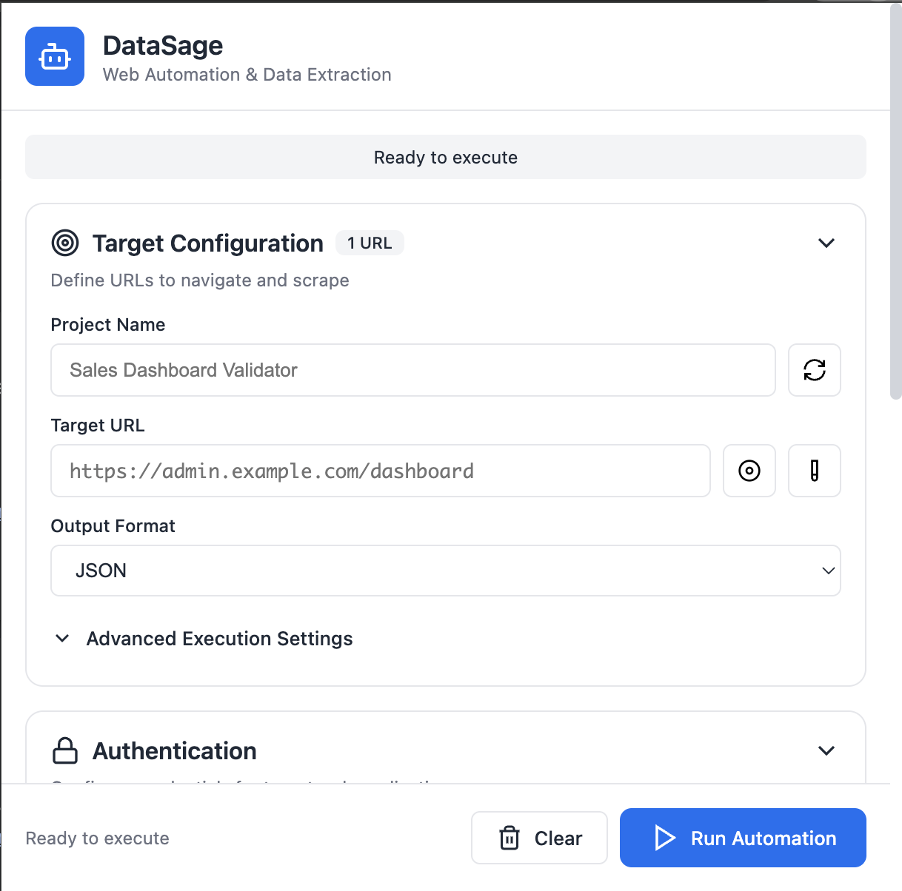

# DataSage

[](docs/datasage_screenshot_1.png)

**DataSage** is a comprehensive web automation and data extraction tool consisting of a Chrome Extension frontend and a Puppeteer-powered backend server. It enables you to scrape websites, handle authentication, extract data using DOM selectors or JavaScript, and export results in multiple formats.

## 🎯 Overview

DataSage uses a **Chrome Extension + Backend Server** architecture:

- **Chrome Extension** - Visual interface for configuring automation tasks
- **Backend Server** - Node.js/Express server with Puppeteer for browser automation

This architecture provides the best of both worlds:
- ✅ Easy-to-use UI in your browser
- ✅ Full browser automation capabilities
- ✅ No CORS limitations
- ✅ Complete access to page content
- ✅ Authentication support

## 📦 Project Structure

```
datasage/
├── datasage-extension/          # Chrome Extension
│   ├── manifest.json           # Extension configuration
│   ├── popup.html              # Main UI
│   ├── popup.js                # UI logic
│   ├── background.js           # Service worker
│   ├── styles.css              # Styling
│   ├── icons/                  # Extension icons
│   └── README.md
│
├── datasage-backend/            # Backend Server
│   ├── server.js               # Express server
│   ├── package.json            # Dependencies
│   ├── .env                    # Configuration
│   ├── routes/
│   │   └── automation.js       # API routes
│   ├── lib/
│   │   ├── puppeteer-runner.js # Automation engine
│   │   ├── authentication.js   # Login handler
│   │   ├── extraction.js       # Data extraction
│   │   └── logger.js           # Logging
│   └── README.md
│
└── out/                         # Static assets from Next.js build
```

## 🚀 Quick Start

### Prerequisites

- Node.js v14+ and npm
- Google Chrome browser

### Step 1: Install and Start Backend Server

```bash
# Navigate to backend folder
cd datasage-backend

# Install dependencies
npm install

# Start the server
npm start
```

The server will start on `http://localhost:3001`

### Step 2: Load Chrome Extension

1. Open Chrome and go to `chrome://extensions`
2. Enable **Developer mode** (toggle in top-right)
3. Click **Load unpacked**
4. Select the `datasage-extension` folder
5. Pin the extension to your toolbar

### Step 3: Run Your First Automation

1. Click the DataSage icon in Chrome
2. Enter a project name (e.g., "Test Scrape")
3. Enter a target URL (e.g., "https://example.com")
4. Add an extraction rule:
   - Click "Add DOM Query"
   - Name: "Page Title"
   - Selector: "h1"
   - Attribute: "textContent"
5. Click "Run Automation"
6. View results!

## 🎨 Features

### Chrome Extension Features

- 📝 **Visual Configuration** - Easy-to-use forms for all settings
- 🔐 **Authentication Support** - Handle login flows
- 📊 **Multiple Extraction Types** - DOM queries and JavaScript evaluation
- 💾 **Persistent Storage** - Save and reload configurations
- 📋 **Execution Logs** - Real-time feedback on automation progress
- 🎯 **Result Viewer** - Display extracted data as JSON
- 📤 **Copy Results** - One-click copy to clipboard

### Backend Server Features

- 🤖 **Puppeteer Automation** - Full browser control
- 🔒 **Authentication** - Automatic login handling
- 🎯 **DOM Extraction** - CSS selectors and XPath
- 💻 **JS Evaluation** - Run custom code in page context
- ⏱️ **Configurable Timeouts** - Control execution timing
- 📝 **Structured Logging** - Detailed execution logs
- 🔄 **Retry Logic** - Automatic retry on failures
- 🎭 **Headless/Visible Mode** - Toggle browser visibility

## 📖 Usage Examples

### Example 1: Extract Dashboard Metrics

**Scenario**: Extract revenue, user count, and order stats from an admin dashboard.

**Configuration**:
- **Project Name**: "Dashboard Metrics"
- **Target URL**: `https://admin.company.com/dashboard`
- **Authentication**: Required
  - Login URL: `https://admin.company.com/login`
  - Username: `admin@company.com`
  - Password: `••••••••`
- **Extraction Rules**:
  1. DOM Query: "Total Revenue" → `.revenue-card .amount` → textContent
  2. DOM Query: "User Count" → `.users-count` → textContent
  3. DOM Query: "Pending Orders" → `.orders-pending` → textContent

### Example 2: Scrape Product Listings

**Scenario**: Extract product names, prices, and availability from an e-commerce site.

**Configuration**:
- **Project Name**: "Product Scraper"
- **Target URL**: `https://shop.example.com/products`
- **Extraction Rules**:
  1. JS Evaluation: "Products" →
  ```javascript
  return Array.from(document.querySelectorAll('.product')).map(p => ({
    name: p.querySelector('.product-name').textContent,
    price: p.querySelector('.price').textContent,
    inStock: !p.querySelector('.out-of-stock')
  }));
  ```

### Example 3: Validate Form Data

**Scenario**: Check that all required form fields are present and properly labeled.

**Configuration**:
- **Project Name**: "Form Validator"
- **Target URL**: `https://app.example.com/signup`
- **Extraction Rules**:
  1. JS Evaluation: "Required Fields" →
  ```javascript
  return Array.from(document.querySelectorAll('input[required]')).map(input => ({
    name: input.name,
    type: input.type,
    label: document.querySelector(`label[for="${input.id}"]`)?.textContent
  }));
  ```

## 🔧 Configuration

### Backend Environment Variables

Create/edit `.env` in `datasage-backend/`:

```bash
PORT=3001                    # Server port
NODE_ENV=development         # Environment
HEADLESS=true               # Run browser in headless mode
PUPPETEER_TIMEOUT=30000     # Default timeout (ms)
LOG_LEVEL=info              # Logging level
```

### Extension Settings

Settings are stored in Chrome's local storage:
- Project configurations
- Authentication credentials
- Extraction rules
- Execution preferences

## 🔍 API Reference

### POST /api/automation

Run a web automation task.

**Request Body**:
```json
{
  "projectName": "string",
  "target": {
    "url": "string"
  },
  "auth": {
    "loginUrl": "string",
    "username": "string",
    "password": "string",
    "selectors": {
      "username": "string",
      "password": "string",
      "submit": "string"
    }
  },
  "execution": {
    "timeout": 30000,
    "retries": 3,
    "headless": true
  },
  "extraction": [
    {
      "name": "string",
      "type": "dom|js",
      "selector": "string",
      "attribute": "string",
      "jsCode": "string"
    }
  ],
  "outputFormat": "json|csv|xml"
}
```

**Response**:
```json
{
  "success": true,
  "projectName": "string",
  "timestamp": "ISO 8601",
  "duration": "string",
  "data": {},
  "logs": []
}
```

## 🛠️ Development

### Backend Development

```bash
cd datasage-backend

# Install dependencies
npm install

# Run with auto-reload
npm run dev

# Run in production
npm start
```

### Extension Development

1. Make changes to files in `datasage-extension/`
2. Go to `chrome://extensions`
3. Click reload icon on DataSage extension
4. Test changes

## 🐛 Troubleshooting

### Backend Won't Start

- ✅ Check Node.js version: `node --version` (need v14+)
- ✅ Delete `node_modules` and reinstall: `rm -rf node_modules && npm install`
- ✅ Check port 3001 is available: `lsof -i :3001`

### Extension Not Appearing

- ✅ Enable Developer Mode in `chrome://extensions`
- ✅ Check all files are present in extension folder
- ✅ Look for errors in Chrome extension console

### "Cannot Connect to Backend"

- ✅ Ensure backend is running: Visit `http://localhost:3001/health`
- ✅ Check backend logs for errors
- ✅ Verify port in extension matches server port

### Data Extraction Returns Null

- ✅ Use Chrome DevTools to verify selectors
- ✅ Check if page requires authentication
- ✅ Increase timeout in advanced settings
- ✅ Check execution logs for specific errors

## 🔐 Security Notes

- ⚠️ Passwords are stored in Chrome's local storage (not encrypted)
- ⚠️ Backend server has no authentication (designed for local use only)
- ⚠️ Extension can only communicate with localhost:3001
- ✅ No data is sent to external servers
- ✅ All automation happens locally on your machine

## 📝 Roadmap

Future improvements:

- [ ] Export to CSV/XML formats
- [ ] Screenshot capture
- [ ] Browser instance pooling
- [ ] Scheduled automations
- [ ] Data validation rules
- [ ] Multiple target URLs per project
- [ ] Custom HTTP headers
- [ ] Proxy support
- [ ] Cloud deployment option

## 🤝 Contributing

Contributions welcome! Please feel free to submit issues and pull requests.

## 📄 License

MIT License - See LICENSE file for details

## 🙏 Acknowledgments

Built with:
- [Puppeteer](https://pptr.dev/) - Headless Chrome automation
- [Express.js](https://expressjs.com/) - Web framework
- Chrome Extensions API

---

**Made with ❤️ for web automation enthusiasts**

For detailed documentation:
- [Chrome Extension README](./datasage-extension/README.md)
- [Backend Server README](./datasage-backend/README.md)
